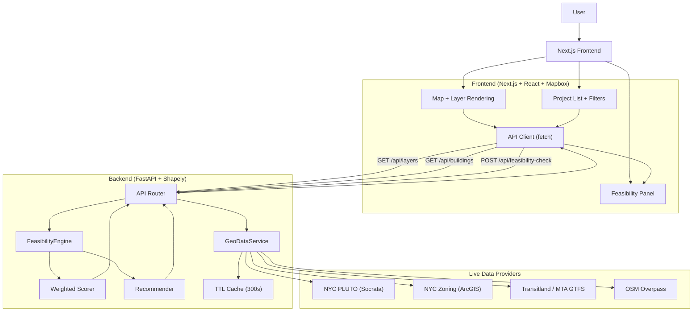

# ReZone Live

**Spatial Intelligence for NYC Office-to-Housing Conversion**

ReZone Live is an interactive geospatial analysis platform for evaluating office-to-residential conversion opportunities in New York City. Users explore the map, inspect buildings in the current viewport, and run a feasibility analysis that scores zoning, utility access, transit access, and structural characteristics.

## Demo Flow

1. **Explore** - Open the full-screen Mapbox map and pan/zoom across NYC.
2. **Load Context** - The frontend fetches live layer data and office inventory for the active map bounds.
3. **Select Site** - Click a building in the map or project list to focus it.
4. **Analyze** - Trigger feasibility analysis to run the backend engine and scoring pipeline.
5. **Decide** - Review overall score, factor breakdown, conflicts, and conversion recommendation with cost/timeline ranges.

## Full Tech Stack

| Layer | Stack | Role |
| --- | --- | --- |
| **Frontend App** | Next.js 16.1.6, React 19.2.3, TypeScript 5 | Single-page dashboard, state orchestration, API integration |
| **Map + Visualization** | Mapbox GL JS 3.20.0, GeoJSON | 3D map rendering, thematic layers, feature selection, viewport-driven querying |
| **Backend API** | FastAPI, Pydantic v2, Uvicorn | REST API, request validation, response schemas, CORS |
| **Spatial Analysis** | Shapely 2.x | Geometry containment, nearest-neighbor and radius proximity queries |
| **Data Access** | httpx, Socrata API, ArcGIS FeatureServer, Transitland API, MTA GTFS feed, Overpass API | Provider integrations and normalization into shared GeoJSON model |
| **Caching** | In-memory TTL cache (300s) | Reduces repeated provider requests for identical bbox/layer queries |
| **Scoring + Recommendation** | Python rules engine (`FeasibilityEngine`, `compute_score`, `recommend`) | Factor scoring, overall tiering, conflict generation, unit/cost/timeline estimates |
| **Testing** | pytest, FastAPI TestClient | Endpoint contract tests and provider normalizer tests |
| **Deployment** | Render (backend), Vercel (frontend) | Managed hosting for API and web client |

## System Architecture



## End-to-End Program Flow

### 1. Viewport-driven data loading

- `frontend/src/app/page.tsx` tracks map bounds (`viewportBbox`) and debounces them into `queryBbox`.
- On each `queryBbox` update, the frontend runs both:
  - `GET /api/layers?bbox=...&layers=...`
  - `GET /api/buildings?bbox=...&limit=...&offset=...`
- `fetchAllBuildings` paginates building results and de-duplicates by `id`.

### 2. Geo layer/provider orchestration

- `GeoDataService` (`backend/app/services/geodata.py`) is initialized at app startup and warmed for Manhattan bounds.
- Layer fetches are cached by `{layer}:{bbox}:{limit}:{offset}` for 300 seconds.
- Provider adapters normalize source payloads into consistent GeoJSON feature properties used throughout the app.

### 3. Analysis execution path

`POST /api/feasibility-check` executes:

1. Resolve target building (by `building_id`, or nearest to provided `lat/lng` within `radius_km`).
2. Run `FeasibilityEngine` modules:
   - `assess_zoning`
   - `assess_utilities`
   - `assess_transit`
   - `assess_structural`
3. Build confidence metrics by domain (`zoning`, `utilities`, `transit`, `structural`).
4. Aggregate factor scores via weighted formula:

```text
overall = zoning*0.30 + utilities*0.25 + transit*0.20 + structural*0.25
```

5. Assign tier (`Excellent`, `Good`, `Moderate`, `Poor`).
6. Generate recommendation (conversion type, estimated units, cost ranges, timeline months).
7. Return full response to frontend panel.

### 4. UI rendering of analysis outputs

- Score ring and tier badge
- Factor-by-factor score and confidence chips
- Conflict list from identified blockers
- Recommendation summary + category cost table

## API Surface

| Method | Endpoint | Purpose |
| --- | --- | --- |
| `GET` | `/health` | Service status, loaded layer counts, total building count |
| `GET` | `/api/layers` | Returns selected GeoJSON layers for bbox |
| `GET` | `/api/buildings` | Returns office building summaries for bbox with pagination |
| `GET` | `/api/buildings/{building_id}` | Returns detailed building payload + geometry |
| `POST` | `/api/feasibility-check` | Runs full conversion feasibility analysis |

## Data Sources

- **Office Buildings:** NYC PLUTO (`data.cityofnewyork.us`)
- **Zoning Districts:** NYC ArcGIS FeatureServer
- **Transit Stops:** Transitland API, with MTA GTFS fallback
- **Utility Infrastructure:** OpenStreetMap Overpass

## Local Development

### 1. Backend

```bash
cd backend
python3 -m venv .venv
source .venv/bin/activate
pip install -r requirements.txt
cp .env.example .env
uvicorn app.main:app --reload --port 8000
```

### 2. Frontend

```bash
cd frontend
npm install
cp .env.example .env.local
npm run dev
```

## Environment Variables

### Backend (`backend/.env`)

| Variable | Required | Description |
| --- | --- | --- |
| `ALLOWED_ORIGINS` | Yes | Comma-separated CORS origins |
| `SOCRATA_APP_TOKEN` | Recommended | Higher-limit access for NYC PLUTO queries |
| `TRANSITLAND_API_KEY` | Recommended | Transitland authenticated access |

### Frontend (`frontend/.env.local`)

| Variable | Required | Description |
| --- | --- | --- |
| `NEXT_PUBLIC_API_URL` | Yes | FastAPI base URL |
| `NEXT_PUBLIC_MAPBOX_TOKEN` | Yes | Mapbox token for map rendering |

## Testing

```bash
# Backend tests
cd backend
pytest

# Frontend lint
cd frontend
npm run lint
```

## Deployment

### Render (Backend)

- `rootDir`: `backend`
- `buildCommand`: `pip install -r requirements.txt`
- `startCommand`: `uvicorn app.main:app --host 0.0.0.0 --port $PORT`
- Required env vars: `ALLOWED_ORIGINS`, `SOCRATA_APP_TOKEN`, `TRANSITLAND_API_KEY`

### Vercel (Frontend)

- Project root: `frontend`
- Build uses standard Next.js pipeline
- Set `NEXT_PUBLIC_API_URL` to your Render backend URL
- Set `NEXT_PUBLIC_MAPBOX_TOKEN`
